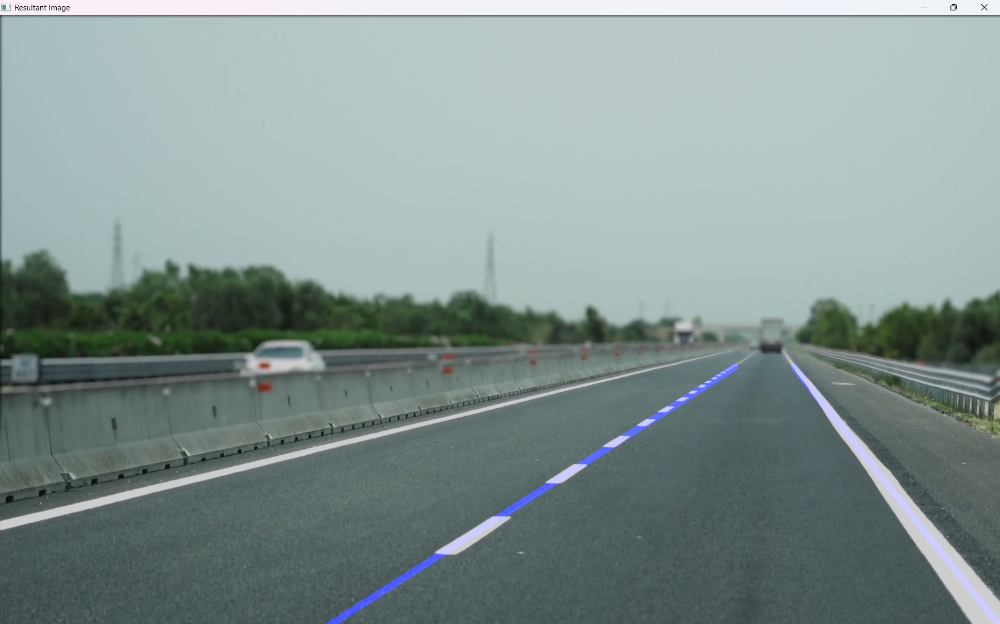
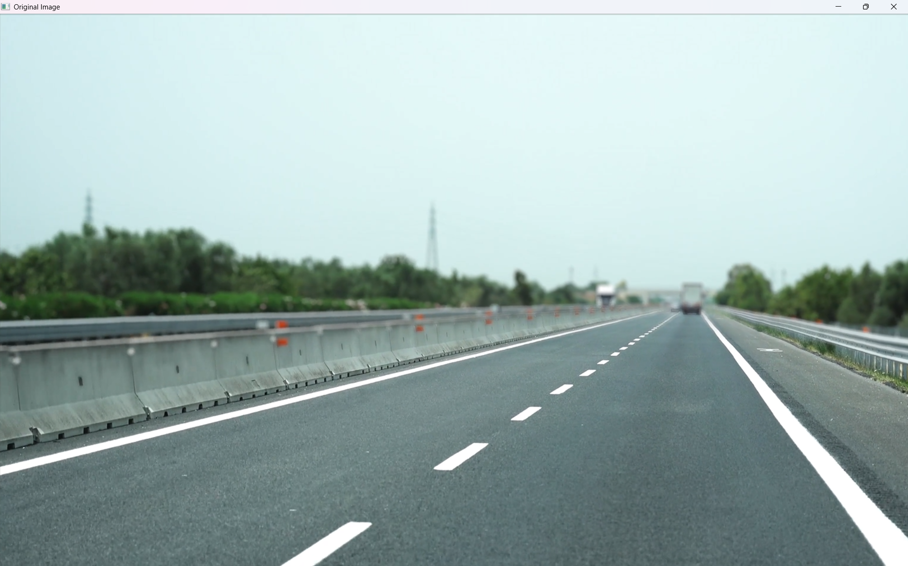
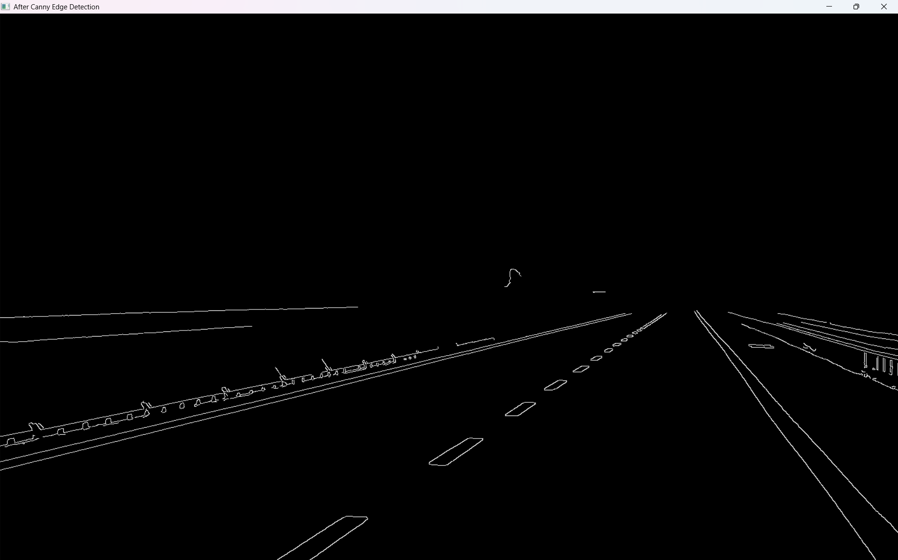
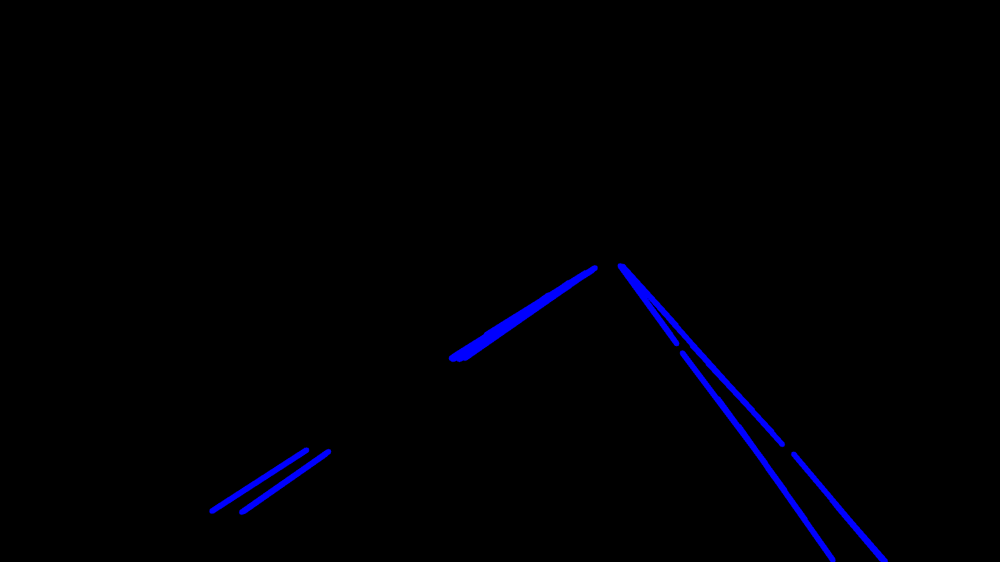
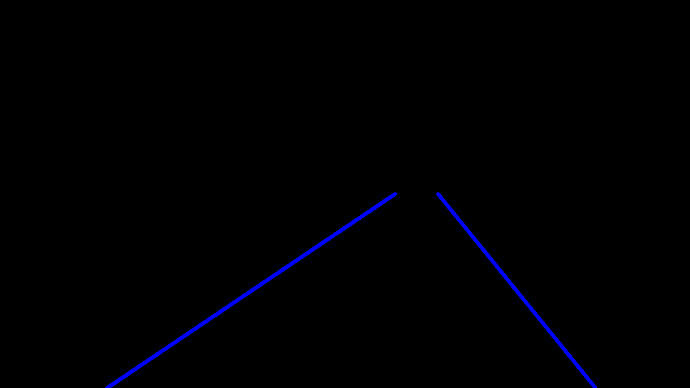
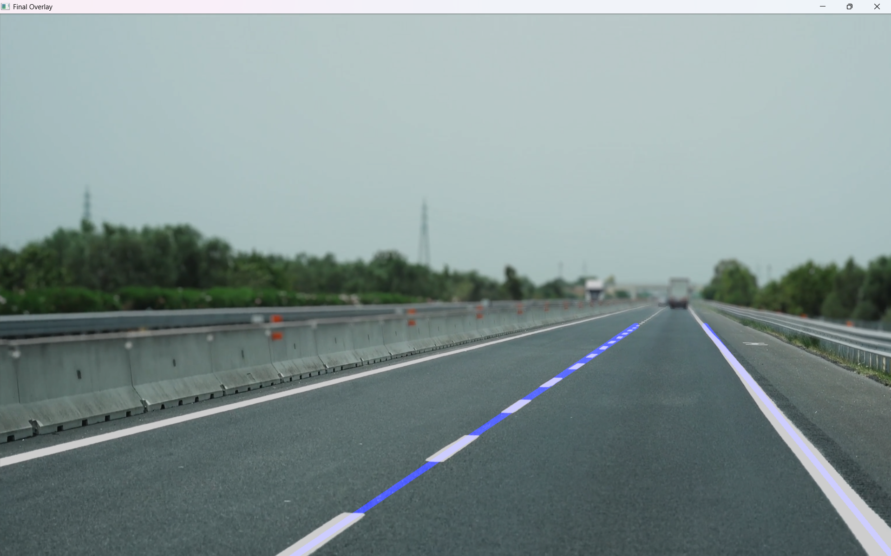

# Lane Detection using OpenCV & Python 🚗🛣️

This project implements a **lane detection system** that identifies road lanes from both **images** and **videos** using **OpenCV** and **NumPy**.  
It uses:
- **Canny Edge Detection** for finding edges
- **Region of Interest (ROI) Masking** to focus on the road
- **Hough Line Transform** for detecting lines
- **Slope & Intercept Averaging** to create smooth lane lines

---

## 📷 Demo

**Image Example**  
*(Detected lanes overlaid on the road)*  


---

## 🔹 Features
✅ Works on **both images & videos**  
✅ Customizable **Region of Interest (ROI)**  
✅ Stable lane detection via **slope-intercept averaging**  
✅ Real-time performance with video input  
✅ Modular, well-structured Python code  

---

## 📂 Project Structure
```
lane-detection-opencv/
│
├── README.md               # Documentation
├── requirements.txt        # Dependencies
├── lane_detection.py       # Main script
├── road.png                # Test image
├── test_video.mp4           # Test video
└── outputs/                 # Output results (optional)
```

---

## ⚙️ Installation
1. **Clone the Repository**
```bash
git clone https://github.com/yourusername/lane-detection-opencv.git
cd lane-detection-opencv
```

2. **Install Dependencies**
```bash
pip install -r requirements.txt
```

---

## ▶️ Usage
### Image
```bash
python lane_detection.py --image road.png
```

### Video
```bash
python lane_detection.py --video test_video.mp4
```
Press **`ESC`** to quit.

---

## 🔄 Processing Pipeline

Here’s the step-by-step visual explanation of how lane detection works:  

| Step | Description | Example |
|------|-------------|---------|
| **1. Original Frame** | Input from camera/video |  |
| **2. Canny Edge Detection** | Detect strong edges |  |
| **3. Region of Interest Mask** | Keep only road area |  |
| **4. Hough Line Transform** | Detect line segments |  |
| **5. Averaging & Extrapolation** | Combine & smooth lines |  |
| **6. Final Overlay** | Draw lanes on frame |  |

---

## 🧠 How It Works
1. **Edge Detection** → Find edges using Canny.
2. **Mask ROI** → Focus on lane area only.
3. **Hough Transform** → Detect straight lines from edges.
4. **Average Lines** → Create smooth left & right lane lines.
5. **Overlay** → Merge lane lines with original image.

---

## 📦 Requirements
```
opencv-python
numpy
matplotlib
```
Install with:
```bash
pip install -r requirements.txt
```

---

## 📜 License
MIT License — Free to use, modify, and distribute.
